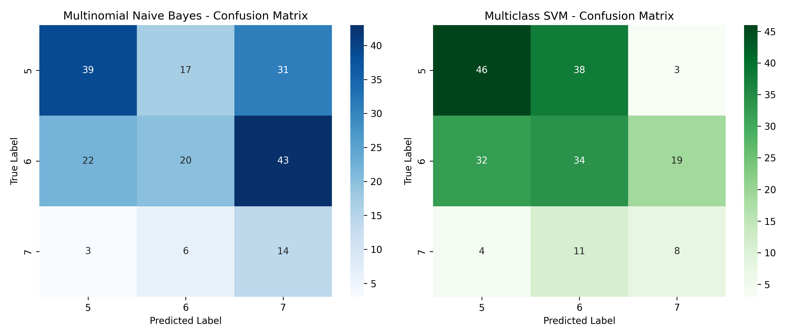
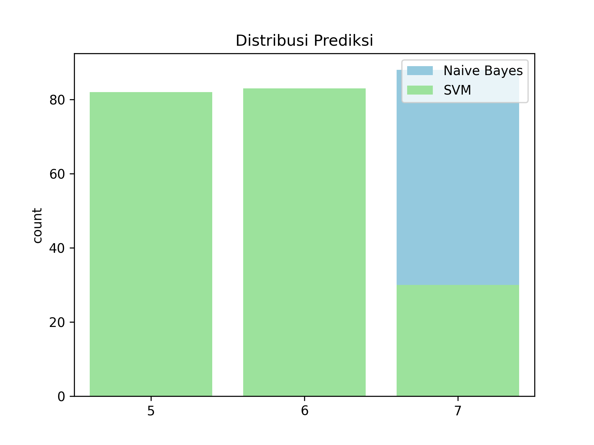
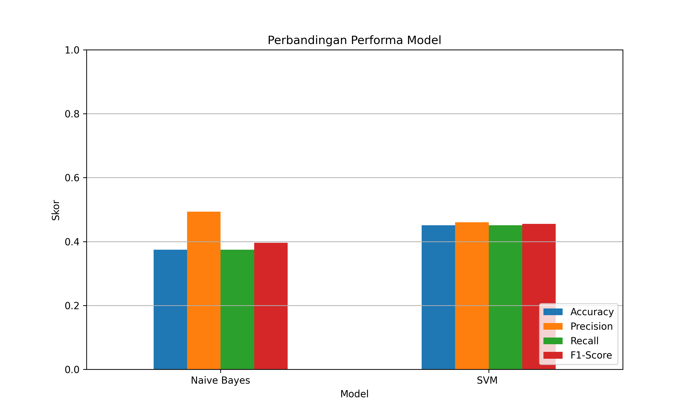

1. Deskripsi Singkat dan Latar Belakang  
- Deskripsi Singkat  
Proyek ini bertujuan untuk membandingkan performa dua algoritma klasifikasi machine learning
yaitu Support Vector Machine (SVM) Multiclass dan Multinomial Naive Bayes (MNB)—dalam mengklasifikasikan
kualitas red wine dari dataset Wine Quality (Vinho Verde). Dataset ini berisi data karakteristik
kimia dari anggur merah, seperti kadar alkohol, keasaman, serta kandungan sulfur, yang digunakan untuk memprediksi kualitas wine pada skala 0–10.  
- Latar Belakang  
Machine Learning (ML) merupakan cabang dari Artificial Intelligence yang memungkinkan komputer
belajar dari data tanpa harus diprogram secara eksplisit. Dalam industri makanan dan
minuman, khususnya wine, pengklasifikasian kualitas produk sangat krusial untuk menjaga standar mutu dan kepuasan pelanggan.  
Dua metode klasifikasi yang umum digunakan adalah SVM Multiclass dan Multinomial Naive Bayes.
SVM dikenal efektif dalam menangani data berdimensi tinggi dan non-linear, sementara MNB unggul
dalam kesederhanaan dan efisiensi komputasi, terutama pada data diskrit seperti teks.
Dengan membandingkan kedua algoritma ini pada dataset Wine Quality, proyek ini bertujuan
mengidentifikasi model yang paling tepat dan efisien untuk klasifikasi kualitas wine berdasarkan fitur kimianya.
2. Penjelasan Dataset
Dataset yang digunakan dalam proyek ini adalah
Wine Quality – Red Wine yang berasal dari UCI Machine Learning Repository (uciml/red-wine-quality-cortez-et-al-2009).
Dataset ini berisi informasi kimia dan sensorik dari sampel anggur merah (Vinho Verde) asal Portugal.
- Spesifikasi Dataset  
Jumlah entri: 1.599 sampel  
Jumlah fitur: 11 fitur numerik + 1 label kualitas (quality)  
Format file: CSV (winequality-red.csv)

Fitur-fitur pada dataset  
| No | Fitur                  | Deskripsi                                                 |
| -- | ---------------------- | --------------------------------------------------------- |
| 1  | `fixed acidity`        | Konsentrasi asam tetap (tidak menguap)                    |
| 2  | `volatile acidity`     | Konsentrasi asam yang mudah menguap (berpengaruh ke rasa) |
| 3  | `citric acid`          | Kandungan asam sitrat                                     |
| 4  | `residual sugar`       | Gula sisa setelah fermentasi                              |
| 5  | `chlorides`            | Kandungan garam                                           |
| 6  | `free sulfur dioxide`  | Sulfur dioksida bebas (pengawet)                          |
| 7  | `total sulfur dioxide` | Total sulfur dioksida                                     |
| 8  | `density`              | Massa jenis wine                                          |
| 9  | `pH`                   | Tingkat keasaman                                          |
| 10 | `sulphates`            | Senyawa sulfat (pengawet & antibakteri)                   |
| 11 | `alcohol`              | Persentase alkohol                                        |
| 12 | `quality` (label)      | Skor kualitas wine (0–10), hasil penilaian oleh ahli      |

Catatan :  
Nilai quality sering kali tidak seimbang (misalnya, sebagian besar berkisar antara 5–6), 
sehingga SMOTE (Synthetic Minority Over-sampling Technique) digunakan untuk menyeimbangkan 
distribusi label sebelum proses pelatihan model.

3. Algoritma yang digunakan
- Support Vector Machine (SVM) – Multiclass
SVM adalah algoritma pembelajaran terawasi (supervised learning) yang digunakan untuk klasifikasi
maupun regresi. SVM bekerja dengan mencari hyperplane terbaik yang memisahkan data ke dalam
kelas-kelas yang berbeda dengan margin terbesar.
Karena klasifikasi wine ini memiliki lebih dari dua kelas (multiclass), maka digunakan 
pendekatan One-vs-Rest (OvR), di mana satu model dibangun untuk setiap kelas terhadap semua kelas lainnya.  
Ciri khas implementasi:
  - Kernel: RBF (Radial Basis Function)
  - Pendekatan: One-vs-Rest
  - Library: sklearn.svm.SVC
- Multinomial Naive Bayes (MNB)
Multinomial Naive Bayes adalah varian dari Naive Bayes yang paling cocok digunakan untuk data diskrit
seperti frekuensi kata dalam teks. Namun dalam konteks ini, setelah proses diskretisasi atau pembulatan,
MNB tetap dapat digunakan untuk fitur numerik, seperti fitur kimia wine, dengan pendekatan probabilistik.
MNB menghitung probabilitas setiap kelas berdasarkan distribusi multinomial dari fitur, dengan
asumsi independen antar fitur.
Ciri khas implementasi:
  - Model probabilistik berbasis frekuensi fitur
  - Sederhana, efisien, cocok untuk baseline klasifikasi
  - Library: sklearn.naive_bayes.MultinomialNB

4. Panduan menjalankan kode
- Persyaratan sistem
pastikan sistem yang dimiliki 
  - Python versi 3.7 atau diatasnya
  - pip untuk kelola dependensi
- Instalasi dependensi dengan cara pip install -r requirements.txt
- Buka file ipynb yang tertera lalu jalankan step by step dari teratas hingga paling bawah

5. Hasil output dan Visualisasi  
## 🔍 Confusion Matrix

## 📊 Distribusi Prediksi

## 📈 Perbandingan Performa Model

6. Kesimpulan  
Berdasarkan penelitian dan implementasi klasifikasi kualitas anggur merah menggunakan
algoritma pembelajaran mesin, diperoleh beberapa kesimpulan sebagai berikut:
- Dataset yang digunakan adalah winequality-red.csv dari UCI Machine Learning Repository,
yang terdiri dari 1.599 data dengan 11 fitur numerik dan satu label kualitas (quality).
Setelah dilakukan pembersihan data, termasuk penghapusan 240 data duplikat dan pemilihan
hanya pada label 5, 6, dan 7, diperoleh 1.518 data untuk proses klasifikasi.
- Distribusi kelas pada data yang digunakan menunjukkan ketidakseimbangan,
dengan jumlah data pada kelas 5 dan 6 jauh lebih banyak dibandingkan kelas 7
Untuk mengatasi hal ini, digunakan metode SMOTE (Synthetic Minority Over-sampling Technique)
guna menyamakan jumlah data pada tiap kelas.
- Dua algoritma pembelajaran mesin yang diterapkan dalam penelitian ini adalah
*Multinomial Naive Bayes* dan *Support Vector Machine (SVM)*. Evaluasi dilakukan dengan menggunakan metrik akurasi,
precision, recall, dan F1-score, serta visualisasi berupa confusion matrix dan distribusi hasil prediksi.
- Berdasarkan hasil evaluasi, model SVM memberikan performa yang lebih baik dibandingkan
Multinomial Naive Bayes dalam hal akurasi dan generalisasi terhadap data uji.
Hal ini menunjukkan bahwa SVM lebih mampu menangani fitur numerik dan hubungan non-linear
antar atribut dibandingkan Naive Bayes yang mengasumsikan independensi antar fitur.
- Visualisasi performa model mendukung kesimpulan bahwa SVM merupakan model yang lebih unggul
dalam kasus klasifikasi multiclass kualitas anggur merah ini, meskipun dari sisi efisiensi
dan kesederhanaan, Naive Bayes tetap memiliki keunggulan tersendiri.
